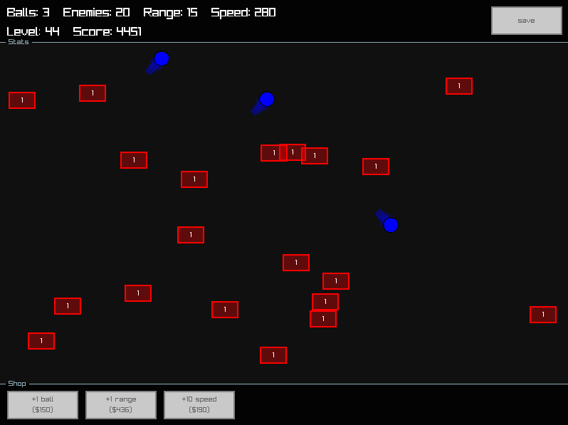

# Squares



Simple bouncing balls demo using raylib and bun.

## Description

```sh
bun dev
```

If not working, change the path to `node-raylib.node` in `node_modules/raylib/src/generated/node-raylib.js` to the raylib build path 
```ts
const r = require(process.cwd() + '/build/Release/node-raylib.node');
```

# Controls

- `ESC` to exit
- `1` buy a ball
- `2` buy a range
- `3` buy a speed
- `LMB` to hit squares
- `RMB` to pause

The state are saved in `./state.json` file. When you buy or level up, the state is saved.
You can save by clicking `save` button.

To restart, delete the `state.json` file.

# Thanks

Thanks to 
[https://www.raylib.com/](https://www.raylib.com/)
and [https://github.com/RobLoach/node-raylib/](https://github.com/RobLoach/node-raylib/)

